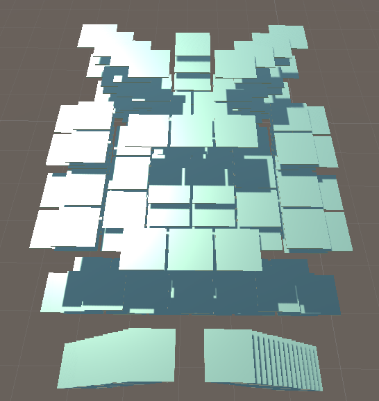
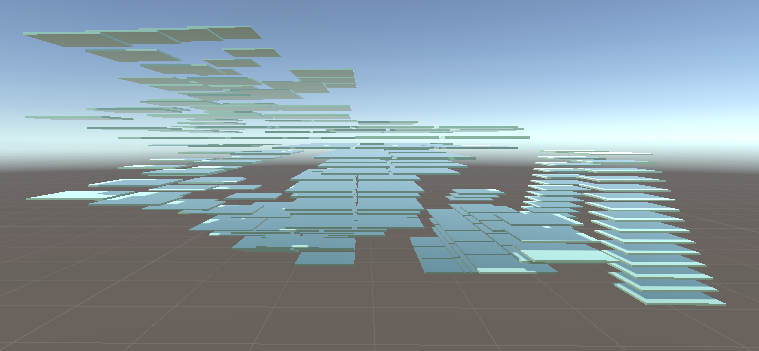

# 羊了个羊3D模型

从网站中获得原始的数据点[链接](https://cat-match-static.easygame2021.com/maps/fdc2ccf2856998d37446c004bcc0aae7.txt)（0919的数据）

比如"id":"1-24-16"就是位于最下面的第一层x=24，y=26的一张牌，在unity中把每张牌都建出来

由于层叠的关系很复杂，按照既定策略消牌时，用这个工具可以方便的查看
